# Architecture: AI-Assisted Incident Precedent Nudge (My Inbox)

> Architecture derived from `context.md`. Describes the MVP system design for surfacing historical incident precedent (and false/duplicate warnings) inside My Inbox at the moment of task review.

---

## 1. Architecture Goals

| Goal | Architectural implication |
|------|---------------------------|
| Same-moment value | Precedent results must be available when the My Inbox task detail loads — prefer **precompute on incident create/update**, not on-demand LLM calls at open time |
| Advisory only | Panel is a read-only presentation layer; no write-back into current incident fields |
| Fail open | My Inbox task UI must load without the AI path; panel is an optional enhancement |
| Governed AI | All model inference stays in **SAP AI Core / Generative AI Hub** — no external LLM egress |
| Noise control | Configurable confidence threshold gates panel visibility |
| Deep link fidelity | Navigation must open a **specific** Manage Incidents record, not a search list |

---

## 2. System Context

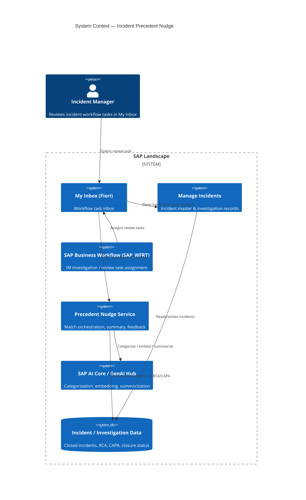

### External actors & systems

| Actor / system | Role in architecture |
|----------------|----------------------|
| Incident Manager | Consumes the precedent panel; may dismiss as “not relevant” |
| My Inbox | Host UI for the panel (FR5) |
| Manage Incidents | Source of truth for incident + investigation data; deep-link target (FR6) |
| SAP AI Core / Generative AI Hub | Governed inference for categorization, similarity, and summary generation |
| SAP Business Workflow (SAP_WFRT) | Creates IM tasks such as investigation steps and “Review and complete investigation” (unchanged for MVP) |

---

## 3. High-Level Solution Architecture

The MVP splits work into **two paths**:

1. **Write path (async, on create/update)** — categorize, embed, search, score, summarize, persist a `PrecedentResult` so the UI path stays fast.
2. **Read path (sync, on task open)** — My Inbox loads a precomputed (or cached) result and renders State A / B / C.

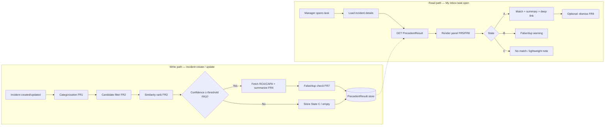

**Why precompute?** Latency NFR requires the panel to appear with the existing detail view. Running embedding search + LLM summary at open time risks multi-second delay and trains managers to ignore the feature.

---

## 4. Logical Components

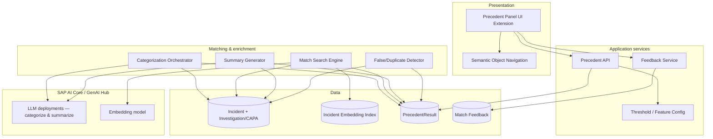

### Component responsibilities

| Component | Responsibility | Maps to |
|-----------|----------------|---------|
| **Precedent Panel UI Extension** | Renders States A/B/C below incident details; AI-advisory styling; dismiss control; deep-link affordance | FR5, FR6, FR8, FR9 |
| **Precedent API** | Serve `PrecedentResult` for an incident ID; respect feature flags / threshold | FR3, FR5 |
| **Feedback Service** | Persist “not relevant” (and optional click-through events for metrics) | FR9, success metrics |
| **Categorization Orchestrator** | On create: type, severity, recordability signal from description + structured fields | FR1 |
| **Match Search Engine** | Filter by location/equipment/category → rank by description similarity → apply confidence threshold | FR2, FR3 |
| **Summary Generator** | Pull RCA + corrective action; produce one-line plain-language summary | FR4 |
| **False/Duplicate Detector** | Separate check for similar past reports closed as not valid / duplicate | FR7 |
| **Threshold / Feature Config** | Configurable match confidence, enable/disable panel, State C behavior | FR3, open Q1 |
| **Incident Embedding Index** | Vector store (or HANA Vector Engine) of closed-incident description embeddings | FR2 |
| **PrecedentResult store** | Persisted panel payload keyed by current incident ID | Latency NFR |

---

## 5. Runtime Flows

### 5.1 Incident create — write path (FR1–FR4, FR7)

```mermaid
sequenceDiagram
    autonumber
    participant IM as Manage Incidents
    participant Bus as Event / Job trigger
    participant Cat as Categorization Orchestrator
    participant AI as AI Core / GenAI Hub
    participant MSE as Match Search Engine
    participant Sum as Summary Generator
    participant FDC as False/Dup Detector
    participant Store as PrecedentResult store

    IM->>Bus: Incident created (or status → ready for review)
    Bus->>Cat: Process incidentId
    Cat->>IM: Read description + structured fields
    Cat->>AI: Categorize (type, severity, recordability)
    AI-->>Cat: Category payload
    Cat->>IM: Persist AI category fields (if allowed)
    Cat->>MSE: Find precedents(incidentId, category, location, equipment)
    MSE->>IM: Query closed incidents (location/equip/category filter)
    MSE->>AI: Embed current description (if not cached)
    MSE->>MSE: Rank by similarity; score confidence
    alt confidence ≥ threshold
        MSE->>Sum: matchedIncidentId
        Sum->>IM: Read RCA + CAPA / corrective action
        Sum->>AI: Generate one-line summary
        AI-->>Sum: summary text
        Sum->>Store: State A payload
    else below threshold
        MSE->>Store: State C (no match)
    end
    MSE->>FDC: Check false/dup patterns at location
    FDC->>IM: Query closed-as invalid/duplicate near location
    alt false/dup signal
        FDC->>Store: Attach State B warning (may coexist with A or stand alone)
    end
```

**Trigger options (decide during build):**

| Option | Pros | Cons |
|--------|------|------|
| Event on incident create / update | Fast freshness | Needs reliable event plumbing |
| Workflow step before “Review” task | Aligns with My Inbox timing | Ties to workflow model |
| Scheduled reprocess job | Simple ops | Stale until job runs |

**MVP recommendation:** Event (or workflow exit) on create + re-run on significant field change (description, location, category). Cap concurrency; enqueue if AI Core is busy.

### 5.2 My Inbox task open — read path (FR5, FR6, FR8)

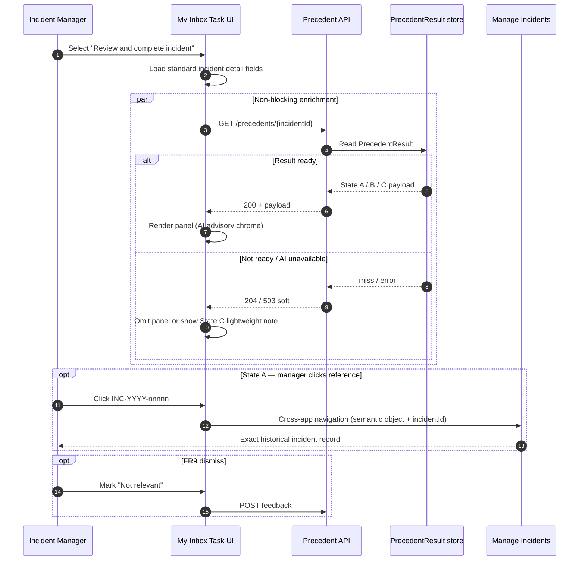

**Fail-open contract:** API errors, timeouts, or empty store **must not** block or error the task UI. Panel simply does not appear (or State C note only).

### 5.3 Deep link (FR6)

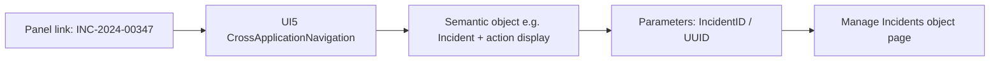

**Hard requirement:** Resolve to a specific object key. A filtered list search is out of scope and fails FR6.

Validate early with the Fiori / UX5 lead:

- Semantic object & action names for Manage Incidents
- Required navigation parameters (internal UUID vs. external number)
- Authorization: manager must be allowed to open historical closed incidents

---

## 6. My Inbox UI Extension Architecture

### 6.0 Observed UI (customer landscape)

Live screens show:

| Surface | What we see | Architecture impact |
|---------|-------------|---------------------|
| **Launchpad — EHS Apps** | Tiles: Report Incident, Manage Incidents, My Inbox (IM), Monitor Incident Work Items, analytics | Deep-link target = Manage Incidents; domain = SAP EHS IM |
| **My Inbox** | Standard master–detail; list “Incident Management”; **Source System SAP_WFRT** | Classic Business Workflow tasks |
| **My Inbox detail** | Generic preview: metadata + assignment text; tabs Information / Notes / Attachments / Related Links; footer **Open Task** | **No full incident object page embedded** — original “panel below incident details” must be reinterpreted |
| **Task types** | e.g. *Perform investigation step 'Root Causes Hierarchy' for Incident ID 388*; *Review and complete investigation…* | Panel must resolve **Incident ID** from the work item, across multiple step types |
| **Manage Incidents** | Object page: Details, Location, People, **Investigation** (Major Root Cause, Open Investigation Details), Tasks, Reports, Documents | RCA/CAPA source for FR4; primary deep-link destination for FR6 |

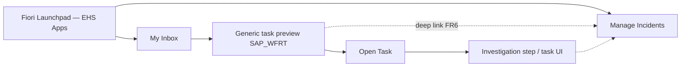

### 6.1 Extension strategies (revised after screen review)

Strategy **A** (already-custom My Inbox incident detail) is **unlikely** given the generic preview.

| Strategy | Fit to observed UI | How panel is added |
|----------|--------------------|--------------------|
| **B. Replace / provide custom task UI** | Open Task currently leaves generic preview | Register a custom My Inbox task UI for IM work items that includes incident summary + Precedent Panel |
| **C. Workflow / My Inbox enhancement on generic preview** | Stay on standard Information tab | Inject advisory MessageView / custom section under the assignment text; keep Claim/Forward/Open Task unchanged |
| **D. Panel on Manage Incidents (Investigation)** | Full incident context already there | Add Precedent Panel on Investigation (or Details) facet; My Inbox only adds Related Link or short teaser |
| **E. Hybrid (recommended for spike)** | Matches how managers work today | Teaser in My Inbox Information tab + full State A/B panel on Manage Incidents / Open Task target |

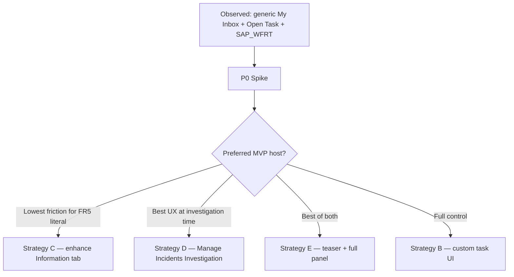

**MVP recommendation (P0):** Strategy **E (hybrid)** — provisionally locked in `p0/decisions/AD-1-panel-host.md`. Managers already jump via **Open Task** / Manage Incidents for real work; put the rich precedent panel where RCA is entered (**Investigation**), and a short advisory teaser in My Inbox so the nudge is still visible at task select. Finalize after live Strategy C/D PoCs.

### 6.2 Panel UI contract

| Element | Behavior |
|---------|----------|
| Placement (revised) | **Primary:** below assignment text on My Inbox Information tab *and/or* on Manage Incidents **Investigation** facet. Exact host = AD-1 outcome |
| States | A (match), B (false/dup warning), C (none / lightweight note) |
| Coexistence | State B may appear with A or alone; never suppress Claim / Forward / Suspend / Open Task |
| Styling | Distinct AI-advisory chrome (icon, wording, “AI-generated suggestion”) — FR8 |
| Actions | Deep link to Manage Incidents by Incident ID; dismiss “Not relevant” (FR9); **no** Apply / Copy RCA buttons |
| Empty / error | Hide panel or State C — never toast-block the task |

### 6.3 State decision matrix

| Precedent match ≥ threshold | False/dup signal | UI |
|-----------------------------|------------------|-----|
| Yes | No | State A |
| Yes | Yes | State A + State B (warning section) |
| No | Yes | State B only |
| No | No | State C (hidden or lightweight note per config) |
| Result missing / AI down | — | No panel (fail open) |

---

## 7. Matching & AI Design

### 7.1 Pipeline stages

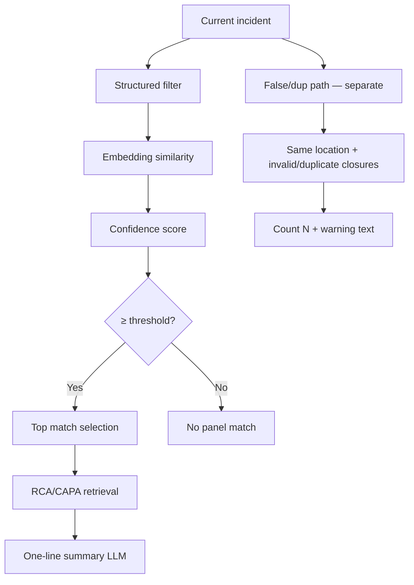

### 7.2 Stage details

| Stage | Input | Logic | Output |
|-------|-------|-------|--------|
| **Structured filter (FR2)** | location, equipment, category (AI or human) | Restrict candidate set to closed incidents sharing keys (configurable looseness) | Candidate set |
| **Similarity (FR2)** | Description embedding of current vs candidates | Cosine / HANA vector distance; optional re-rank | Ranked list + raw scores |
| **Confidence (FR3)** | Similarity + optional boosts (same equipment, same category) | Normalized 0–1 score; compare to config threshold | Pass/fail for panel |
| **Top match** | Ranked list above threshold | MVP: single best match (keep UX simple) | `matchedIncidentId` |
| **Summary (FR4)** | **Major Root Cause** + investigation details / CAPA (via Open Investigation Details data) | GenAI Hub prompt → one plain-language line | `summaryText` |
| **False/dup (FR7)** | location + description similarity among invalid/duplicate closures | Separate from precedent match; distinct warning | `falseDupCount`, message |

### 7.3 Categorization (FR1)

Runs on create using description + structured fields.

Suggested output schema:

```json
{
  "incidentType": "string",
  "severity": "Low|Medium|High|Critical",
  "recordabilitySignal": "LikelyRecordable|LikelyNonRecordable|Unclear",
  "confidence": 0.0
}
```

Stored on the incident (or side table) and used as a filter key for matching. Categorization errors must not block incident create.

### 7.4 Model deployment (governance)

| Capability | Runtime | Notes |
|------------|---------|-------|
| Categorization | GenAI Hub LLM (prompt + schema) | Grounded on incident fields only |
| Embeddings | Embedding model on AI Core / HANA | Closed-incident corpus indexed asynchronously |
| Summary | GenAI Hub LLM | Prompt constrained to RCA/CAPA fields — no speculation |
| Prompt templates | Versioned in GenAI Hub | Auditability for IT/legal |

**Data boundary:** Incident text never leaves the SAP landscape. No third-party public LLM endpoints.

### 7.5 Prompt / grounding guardrails

- Summary prompt may only use retrieved RCA and corrective action fields.
- If RCA/CAPA missing → do not invent; either skip State A or show match link without summary.
- Wording templates emphasize advisory language (“for reference”, “you may check”).

---

## 8. Data Architecture

### 8.1 Core entities

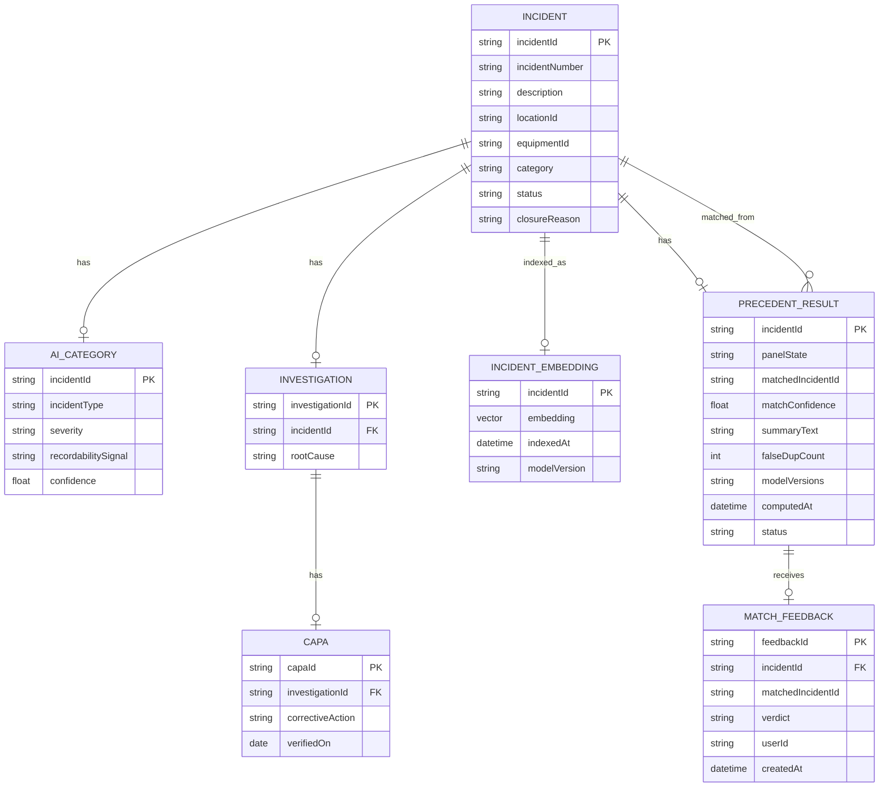

### 8.2 `PrecedentResult` payload (API / UI contract)

```json
{
  "incidentId": "uuid",
  "status": "READY|PENDING|UNAVAILABLE",
  "states": {
    "precedent": {
      "show": true,
      "matchedIncidentId": "uuid",
      "matchedIncidentNumber": "INC-2024-00347",
      "matchConfidence": 0.87,
      "summaryText": "Root cause: guard rail missing on conveyor. Action taken: guard installed, verified 03 Mar 2025.",
      "deepLink": {
        "semanticObject": "Incident",
        "action": "display",
        "params": { "IncidentID": "uuid" }
      }
    },
    "falseDuplicate": {
      "show": true,
      "count": 3,
      "messageKey": "PRECEDENT_FALSE_DUP_WARNING"
    },
    "noMatch": {
      "show": false,
      "showLightweightNote": true
    }
  },
  "aiDisclosure": {
    "labelKey": "AI_GENERATED_ADVISORY",
    "isAuthoritative": false
  },
  "computedAt": "2026-08-05T12:00:00Z",
  "modelVersions": {
    "embedding": "text-embedding-vX",
    "summary": "gpt-sap-vY"
  }
}
```

### 8.3 Feedback (FR9)

```json
{
  "incidentId": "uuid",
  "matchedIncidentId": "uuid",
  "verdict": "NOT_RELEVANT",
  "userId": "managerId",
  "createdAt": "ISO-8601"
}
```

Logged even if unused for tuning in v1. Optional analytics events: `panel_shown`, `deep_link_clicked`, `false_dup_confirmed` (supports success metrics).

### 8.4 Indexing strategy

| Data | Strategy |
|------|----------|
| Closed incidents with usable description | Embed on close (or nightly backfill) |
| Open / incomplete RCA | Eligible for match identity, but summary may be omitted |
| Invalid / duplicate closures | Indexed in a separate false/dup candidate pool for FR7 |
| Re-embed | On model version change — batch job with `modelVersion` stamp |

---

## 9. API Surface (MVP)

| Method | Path | Purpose |
|--------|------|---------|
| `GET` | `/precedents/{incidentId}` | Return `PrecedentResult` for panel |
| `POST` | `/precedents/{incidentId}/recompute` | Admin / support re-run match (optional MVP) |
| `POST` | `/precedents/{incidentId}/feedback` | FR9 dismiss / not relevant |
| `GET` | `/config/precedent` | Threshold, State C mode, feature flag (read) |

**SLA for GET:** Sub-second from store/cache. No synchronous LLM on this path in MVP.

**Error semantics:** Prefer `204` / empty READY-false over hard `5xx` to the UI; log server-side for ops.

---

## 10. Deployment Topology (SAP BTP-oriented)

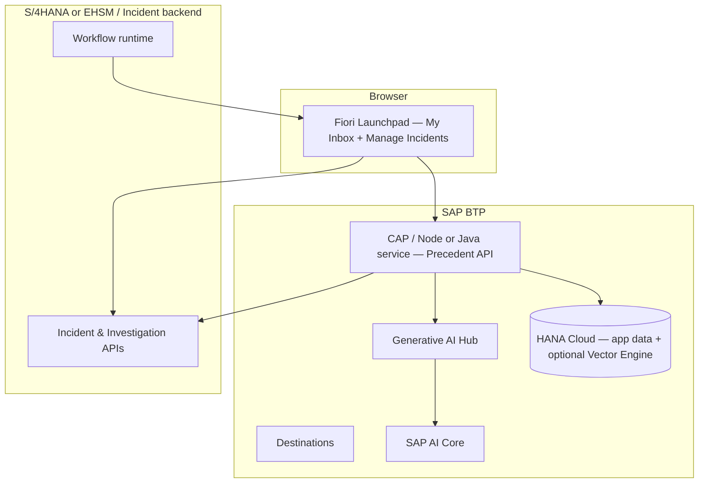

| Layer | Technology choices (typical) |
|-------|------------------------------|
| UI | SAPUI5 / Fiori Elements extension in My Inbox task UI |
| Service | CAP (Node.js or Java) on Cloud Foundry / Kyma |
| AI | Generative AI Hub → AI Core deployments |
| Persistence | HANA Cloud (results, feedback, embeddings via Vector Engine or external vector index still inside landscape) |
| Integration | Destination service to S/4 / Incident OData or RAP APIs |

Exact backend product (S/4 EHS, custom IM, etc.) is an environment-specific binding — architecture assumes **OData/RAP-accessible** incident + investigation entities.

---

## 11. Non-Functional Architecture

### 11.1 Latency

| Path | Target | Mechanism |
|------|--------|-----------|
| Panel on task open | Within existing detail load | Precomputed `PrecedentResult` + CDN/edge not required; local cache optional |
| Write path | Seconds–minutes after create OK | Async queue; UI shows State C/pending until READY |
| Summary LLM | Write path only | Never on GET |

If result is still `PENDING` when manager opens the task: show nothing or “Checking similar incidents…” briefly, then upgrade in-place **without** blocking actions — or accept first-open miss and refresh on reopen (MVP-acceptable if create→review gap is long enough).

### 11.2 Availability & graceful degradation

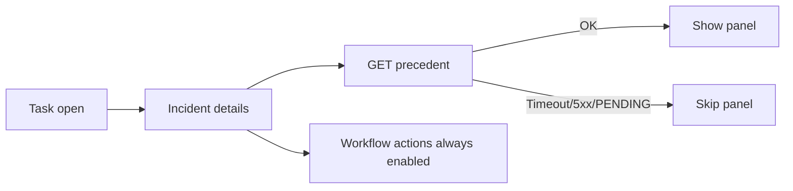

- Circuit breaker around AI Core on write path.
- Feature flag to disable panel globally without redeploy.
- Never gate workflow completion on AI.

### 11.3 Security & governance

| Concern | Control |
|---------|---------|
| Sensitive incident data | Stay in SAP landscape; GenAI Hub only |
| Authorization | Precedent API enforces same incident read auth as My Inbox task; deep link respects Manage Incidents auth |
| Audit | Log model versions, prompts template IDs, match IDs shown |
| OSHA / investigation integrity | No auto-fill of RCA/category/closure — enforced by omitting write APIs from panel |
| AI disclosure | Mandatory UI + API `aiDisclosure` flag (FR8) |

### 11.4 Observability

- Metrics: compute success rate, p95 GET latency, panel show rate by state, click-through, dismiss rate, AI Core error rate.
- Correlate with success metrics in `context.md` §9.

---

## 12. Mapping: Requirements → Architecture

| Req | Architecture element |
|-----|----------------------|
| FR1 | Categorization Orchestrator + GenAI Hub on create |
| FR2 | Match Search Engine: structured filter + embedding rank |
| FR3 | Confidence score + config threshold; gate State A |
| FR4 | Summary Generator grounded on RCA/CAPA |
| FR5 | My Inbox UI extension below detail fields |
| FR6 | Semantic object deep link with incident key |
| FR7 | False/Duplicate Detector — separate signal/UI |
| FR8 | Advisory copy + visual AI disclosure in panel |
| FR9 | Feedback Service + `MATCH_FEEDBACK` persistence |
| Latency | Precompute + sync GET |
| Governance | AI Core / GenAI Hub only |
| Fail open | Soft API failures; UI never blocked |

---

## 13. Explicit Non-Goals (MVP Architecture)

| Non-goal | Reason |
|----------|--------|
| Auto-fill RCA / category / closure | OSHA + investigation quality; MVP guardrail |
| Change My Inbox list view | Out of MVP UX scope |
| Multi-match carousel | Keep cognitive load low — single best match |
| AI blocking workflow steps | Advisory only (open Q2 recommendation) |
| External / public LLM | Governance NFR |
| Perfect historical coverage | Dependent on RCA data quality audit |

---

## 14. Build Phasing (Architecture-aligned)

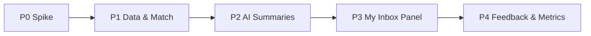

| Phase | Deliverables | Exit criteria |
|-------|--------------|---------------|
| **P0 — Spike** | Confirm panel host (B/C/D/E); extract Incident ID from SAP_WFRT work item; prove deep link into Manage Incidents object page (optionally Investigation tab) | AD-1 locked; FR6 demo with real Incident ID (e.g. pattern like 388) |
| **P1 — Data & match** | Closed-incident index, filter+similarity, threshold, `PrecedentResult` store | Offline eval on sample corpus |
| **P2 — AI** | Categorization + summary via GenAI Hub; false/dup detector | Governed prompts; no egress |
| **P3 — UI** | Panel States A/B/C in My Inbox; advisory styling; fail open | Latency + UX review with Incident Managers |
| **P4 — Feedback** | FR9 logging; click-through metrics | Dashboards for MVP validation metrics |

---

## 15. Open Architectural Decisions

| ID | Decision | Options | Recommendation |
|----|----------|---------|----------------|
| AD-1 | Panel host UI | B / C / D / E in §6.1 (A unlikely) | **Provisionally locked: E (hybrid)** — see `p0/decisions/AD-1-panel-host.md`; FINAL after live C/D PoC |
| AD-2 | Vector store | HANA Vector Engine vs. AI Core-attached store | **Tentative: HANA Vector** — `p0/decisions/AD-2-AD-3-tentative.md` |
| AD-3 | Write-path trigger | Event vs. workflow vs. batch | **Tentative: event on create + significant update** — same doc |
| AD-4 | Confidence threshold | Fixed vs. per-category | **Initial global 0.5** from `p1/eval` sample sweep; re-lock after live corpus + EHS review |
| AD-5 | State C UX | Hide vs. lightweight note | Lightweight note for trust (“feature works”) |
| AD-6 | State B severity | Advisory vs. soft gate | **Confirmed advisory only** — `p2/governance/AD-6-advisory-only.md` |
| AD-7 | Pending result on first open | Poll / omit / skeleton | Omit or brief non-blocking skeleton |
| AD-8 | Feedback ownership | Product vs. Safety ops | **Log-only v1** — `p4/docs/AD-8-feedback-ownership.md` |

---

## 16. Risk Register (Architecture)

| Risk | Impact | Mitigation |
|------|--------|------------|
| Generic My Inbox preview cannot host rich panel | FR5 “below incident details” not literal | Strategy E/D — panel on Manage Incidents Investigation; teaser in inbox |
| Incident ID only in task title text | Unreliable API key | Confirm work-item container/BO parameters in SAP_WFRT |
| Deep link only supports search | Breaks FR6 | Validate semantic navigation early |
| Sparse RCA/CAPA on closed incidents | Weak summaries / low trust | Data quality audit; allow link-only State A |
| Slow on-demand AI | Managers ignore panel | Precompute architecture (mandatory for MVP) |
| Overconfident wrong matches | Harm investigation quality | Strict threshold; FR8 disclosure; FR9 dismiss |
| AI Core outage | No panel | Fail open; circuit breaker; feature flag |

---

## 17. Reference: End-to-End View

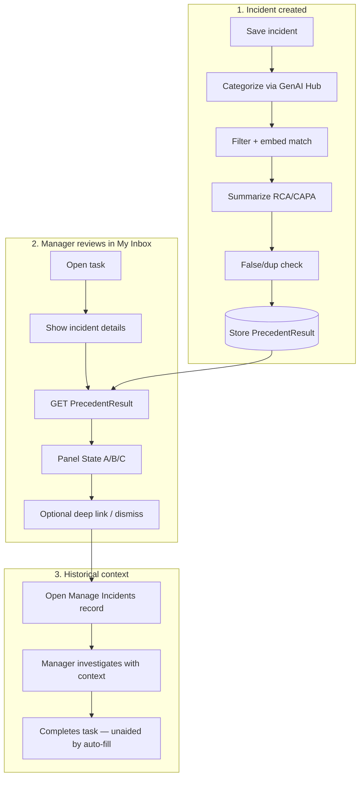

---

*Derived from `context.md`. Update this document when extension strategy (AD-1), data stores, or AI deployment choices are locked in P0/P1.*
