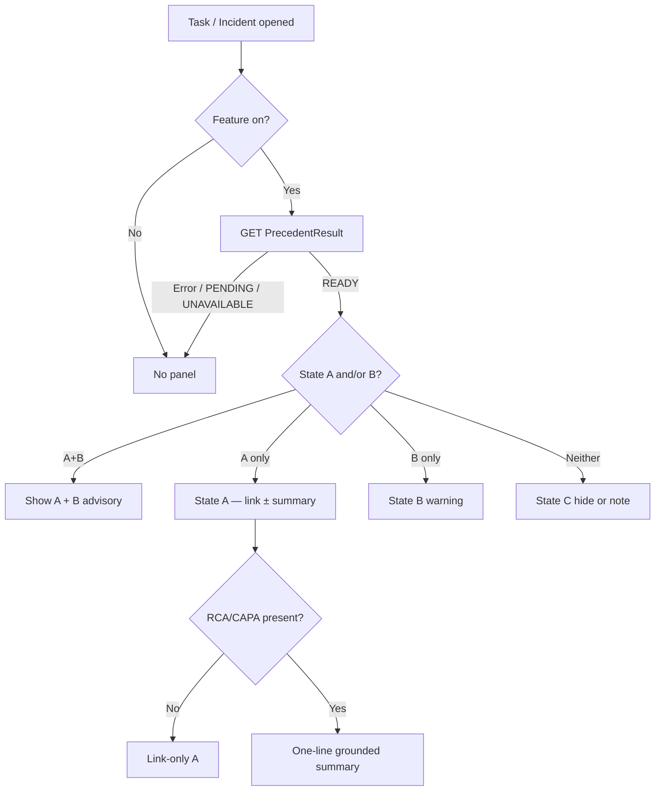

# Edge Cases: AI-Assisted Incident Precedent Nudge

> Exhaustive edge-case catalog for design, build, and QA.  
> Derived from `context.md`, `architecture.md`, and `implementationPlan.md`.  
> **Default principle:** fail open, stay advisory, never invent RCA, never block workflow.

---

## How to use this document

| Column | Meaning |
|--------|---------|
| **ID** | Stable edge-case ID (`EC-xx-nn`) |
| **Scenario** | What goes wrong / unusual |
| **Expected behavior** | MVP-correct system response |
| **Severity** | P0 = must handle before pilot; P1 = should handle in MVP; P2 = post-MVP / rare |
| **Verify** | Suggested test or check |

**Legend — Severity**

- **P0** — Safety, compliance, or workflow-blocking risk if mishandled  
- **P1** — Trust / UX / correctness risk for pilot  
- **P2** — Rare or polish; track but don’t block MVP  

---

## 1. Panel state combinations (UX)

| ID | Scenario | Expected behavior | Sev | Verify |
|----|----------|-------------------|-----|--------|
| EC-UX-01 | Match ≥ threshold, no false/dup | **State A** only | P0 | Golden path demo |
| EC-UX-02 | No match, false/dup signal present | **State B** only | P0 | Seed invalid/dup at same location |
| EC-UX-03 | Match ≥ threshold **and** false/dup | **State A + State B** together; B visually distinct (warning) | P0 | Coexistence fixture |
| EC-UX-04 | No match, no false/dup | **State C**: hide panel **or** lightweight “no similar past incidents” note (per AD-5 config) | P0 | Config both modes |
| EC-UX-05 | Result missing / PENDING / UNAVAILABLE | **No panel** (or non-blocking skeleton); task fully usable | P0 | Force PENDING row |
| EC-UX-06 | Feature flag OFF | No panel anywhere; My Inbox / Manage Incidents behave as today | P0 | Toggle flag |
| EC-UX-07 | State C “hide” mode vs “note” mode | Same backend State C; UI respects config without looking “broken” | P1 | Switch AD-5 |
| EC-UX-08 | Manager switches tasks rapidly in My Inbox | Panel/teaser updates to new Incident ID; no stale match from previous task | P0 | Rapid selection test |
| EC-UX-09 | Same incident open in My Inbox teaser **and** Manage Incidents panel | Both show consistent State A/B/C from same `PrecedentResult` | P1 | Hybrid host |
| EC-UX-10 | List view in My Inbox | **Unchanged** — no precedent badges/counts on list items (MVP) | P1 | Visual regression |

---

## 2. Matching & confidence (FR2 / FR3)

| ID | Scenario | Expected behavior | Sev | Verify |
|----|----------|-------------------|-----|--------|
| EC-MT-01 | Confidence **just below** threshold | No State A; State C (or B-only if applicable) | P0 | Score = threshold − ε |
| EC-MT-02 | Confidence **exactly at** threshold | Define rule: **≥** shows State A (document in config) | P0 | Score = threshold |
| EC-MT-03 | Multiple candidates above threshold | Show **single best** match only (no carousel) | P0 | Tie-break fixture |
| EC-MT-04 | Exact score tie between two incidents | Deterministic tie-break (e.g. most recent closed date, then lower ID) | P1 | Equal scores |
| EC-MT-05 | Same description, **different location** | Prefer filtered-out or heavily down-ranked; do not show weak cross-site match as strong precedent | P0 | Cross-location twins |
| EC-MT-06 | Same location, unrelated description | Below threshold → no State A | P1 | Same-site noise |
| EC-MT-07 | Empty candidate set after structured filter | State C (don’t fall back to global unfiltered search in MVP unless explicitly configured) | P1 | Exotic location |
| EC-MT-08 | Loosen filter when zero candidates | If configured fallback: still require threshold; never show low-confidence noise | P2 | Config matrix |
| EC-MT-09 | Current incident matches **itself** (recompute / reindex bug) | Exclude self / same incident ID from candidates | P0 | Recompute on indexed incident |
| EC-MT-10 | Match points to **open** (not closed) incident | MVP: only **closed** historical incidents eligible | P0 | Open sibling |
| EC-MT-11 | Near-duplicate descriptions at same site (true recurrence) | High confidence State A — intended positive | P1 | Recurrence fixture |
| EC-MT-12 | Threshold changed after results stored | Recompute job or versioned threshold: stale panels either refresh or show until recompute (define policy) | P1 | Change threshold mid-pilot |
| EC-MT-13 | Embedding model version changes | Old vectors not mixed blindly; re-embed or compare only same `modelVersion` | P1 | Version stamp test |
| EC-MT-14 | Very short / boilerplate description (“Injury”, “See attachment”) | Low similarity confidence → State C; don’t over-match on generic text | P0 | Boilerplate corpus |
| EC-MT-15 | Description only in attachment / image, empty text field | No reliable embed → State C; categorization may be Unclear | P1 | Empty description |
| EC-MT-16 | Non-English / mixed-language description | Document MVP language scope; if unsupported, degrade to State C rather than garbage match | P1 | Locale samples |
| EC-MT-17 | Special characters, HTML, or pasted email noise in description | Sanitize for embed/prompt; no XSS in panel summary | P0 | Injection strings |

---

## 3. Incident & investigation data quality (FR4)

| ID | Scenario | Expected behavior | Sev | Verify |
|----|----------|-------------------|-----|--------|
| EC-DQ-01 | Matched incident has **no Major Root Cause** | **Link-only State A** — show reference + deep link; **no** invented summary | P0 | Match with empty RCA |
| EC-DQ-02 | Root cause present, **no** corrective action / CAPA | Summary from root cause only, or link-only if prompt requires both — pick one rule and stick to it | P1 | RCA-only fixture |
| EC-DQ-03 | CAPA present, root cause empty | Do not invent root cause; link-only or action-only per rule | P1 | CAPA-only |
| EC-DQ-04 | Investigation status = New / in progress on matched closed incident (data inconsistency) | Prefer closed + usable RCA; if inconsistent, link-only or skip match | P1 | Dirty data |
| EC-DQ-05 | Multiple investigations on matched incident | Use latest completed / primary investigation (define rule) | P1 | Multi-investigation |
| EC-DQ-06 | Current incident has no location | Structured filter weakened; require higher similarity or State C | P1 | Null location |
| EC-DQ-07 | Current incident has no category / equipment | Filter on available keys only; don’t fail compute | P1 | Sparse structured fields |
| EC-DQ-08 | Historical corpus empty (new plant) | Always State C; lightweight note helps trust | P0 | Empty index plant |
| EC-DQ-09 | Historical incidents closed years ago with obsolete equipment | Still eligible if above threshold; optional recency boost later (P2) | P2 | Old match |
| EC-DQ-10 | Matched incident later **reopened** or status changed | Periodic recompute or invalidate `PrecedentResult` when match status changes | P1 | Reopen matched ID |
| EC-DQ-11 | Matched incident **archived / deleted** / no longer readable | Don’t show broken link; recompute → drop State A or mark UNAVAILABLE for that match | P0 | Delete/archive match |
| EC-DQ-12 | OSHA 301 / recordable sensitive narrative | Still advisory only; summary must not add clinical/legal conclusions beyond source fields | P0 | Prompt grounding test |

---

## 4. False / duplicate warnings (FR7)

| ID | Scenario | Expected behavior | Sev | Verify |
|----|----------|-------------------|-----|--------|
| EC-FD-01 | N past invalid/dup at location, similar description | State B with accurate **N** | P0 | Seed N=3 |
| EC-FD-02 | Invalid/dup at location but **dissimilar** description | No State B (avoid location-only scare) | P0 | Same site, different story |
| EC-FD-03 | N = 1 | Wording still correct singular/plural | P1 | i18n |
| EC-FD-04 | N very large (e.g. 50) | Show N; don’t list all IDs in MVP | P1 | Stress count |
| EC-FD-05 | Closure reason code ambiguous / unmapped | Don’t count; log for config fix | P0 | Unknown reason code |
| EC-FD-06 | State B alone (no State A) | Warning only; **does not** block Claim / Forward / Open Task / complete | P0 | Workflow actions enabled |
| EC-FD-07 | Manager proceeds despite State B | Allowed — advisory only (AD-6) | P0 | Complete task with B visible |
| EC-FD-08 | Current report is legitimate but site has many past false alarms | State B may show — disclosure must say “verify”, not “this is false” | P0 | Copy review |
| EC-FD-09 | False/dup pool includes the current incident after mistaken early close | Exclude self | P1 | Self in pool |
| EC-FD-10 | Precedent match **is** one of the invalid/dup set | Prefer State B emphasis; avoid recommending an invalid case as State A best practice | P0 | Match ID ∈ invalid set |

---

## 5. Categorization (FR1)

| ID | Scenario | Expected behavior | Sev | Verify |
|----|----------|-------------------|-----|--------|
| EC-CAT-01 | Categorization AI timeout / error | Incident create **succeeds**; match may use human/structured fields only or defer | P0 | Kill AI on create |
| EC-CAT-02 | Low categorization confidence | Store Unclear / low confidence; don’t block; filter may ignore weak AI category | P1 | Low-confidence response |
| EC-CAT-03 | AI category conflicts with user-selected category | Define precedence (prefer human for filter in MVP) | P1 | Conflict fixture |
| EC-CAT-04 | RecordabilitySignal wrong | Advisory signal only — **never** auto-write OSHA determination fields | P0 | Field write audit |
| EC-CAT-05 | Recategorize after description edit | Recompute precedent on significant field change | P1 | Edit description |

---

## 6. AI / GenAI Hub / embeddings

| ID | Scenario | Expected behavior | Sev | Verify |
|----|----------|-------------------|-----|--------|
| EC-AI-01 | GenAI Hub / AI Core **full outage** | Write path → PENDING/UNAVAILABLE; GET soft-fail; **UI fail open** | P0 | Block destination |
| EC-AI-02 | Intermittent AI errors | Retry with backoff; circuit breaker opens; no incident create failure | P0 | Flaky mock |
| EC-AI-03 | Summary LLM returns speculative text not in RCA | Reject / regenerate / fall back to link-only (grounding guardrail) | P0 | Prompt eval set |
| EC-AI-04 | Summary LLM returns empty / refuse | Link-only State A | P1 | Empty completion |
| EC-AI-05 | Summary too long / multi-paragraph | Truncate / constrain to one line in UI | P1 | Verbose model |
| EC-AI-06 | Embedding service down; LLM up | Skip new embeds; don’t unblock with random matches; PENDING or State C | P0 | Embed outage |
| EC-AI-07 | Prompt injection in incident description (“ignore instructions…”) | Grounded prompts; no tool/write side effects; no auto-fill | P0 | Injection corpus |
| EC-AI-08 | PII / names in description passed to Hub | Allowed only inside SAP landscape; still show advisory disclosure; follow retention policy | P1 | Data governance review |
| EC-AI-09 | Model deprecated / deployment renamed | Version pin + alerting; graceful UNAVAILABLE not hard crash | P1 | Swap deployment |
| EC-AI-10 | Token / quota exhaustion | Circuit breaker; feature flag; ops alert | P1 | Quota mock |

---

## 7. Write path / timing / precompute

| ID | Scenario | Expected behavior | Sev | Verify |
|----|----------|-------------------|-----|--------|
| EC-WR-01 | Manager opens task **before** compute finishes | PENDING → no panel or brief non-blocking hint (AD-7); reopen later shows READY | P0 | Fast claim after create |
| EC-WR-02 | Create → review gap is long | READY before open — happy path | P1 | Normal SLA |
| EC-WR-03 | Significant fields change after READY | Recompute; avoid showing stale match indefinitely | P0 | Change location/description |
| EC-WR-04 | Duplicate compute jobs for same incident | Idempotent upsert of `PrecedentResult` | P1 | Double event |
| EC-WR-05 | Compute job crashes mid-way | Leave PENDING/UNAVAILABLE; retry; never partial corrupt State A with wrong ID | P0 | Kill job mid-run |
| EC-WR-06 | Backfill still running for plant | New incidents can compute against partial index; document limited recall | P1 | Mid-backfill |
| EC-WR-07 | Recompute admin endpoint abused | AuthZ restricted to support/admin | P1 | Role test |
| EC-WR-08 | Clock skew / delayed event | Eventually consistent; UI fail open meanwhile | P2 | Delayed bus |

---

## 8. My Inbox / SAP_WFRT / task binding

| ID | Scenario | Expected behavior | Sev | Verify |
|----|----------|-------------------|-----|--------|
| EC-IN-01 | Incident ID only in task **title** text, not container | **Must not** ship on parse-title alone if unstable — P0 spike must prove BO parameter | P0 | P0.2 spike |
| EC-IN-02 | Work item has **no** resolvable Incident ID | No panel; no error toast that blocks task | P0 | Malformed WI |
| EC-IN-03 | Task type **not** on MVP allow-list | No panel (e.g. non-investigation steps) | P1 | Out-of-scope step |
| EC-IN-04 | Task: Root Causes Hierarchy for Incident 388 | Panel/teaser if allow-listed | P0 | Live task type |
| EC-IN-05 | Task: Review and complete investigation | Panel/teaser if allow-listed | P0 | Live task type |
| EC-IN-06 | Multiple work items for **same** Incident ID | Each shows same `PrecedentResult` | P1 | Multi-step same ID |
| EC-IN-07 | Forward / Claim / Suspend while panel loading | Actions always work; panel must not intercept | P0 | Click-race |
| EC-IN-08 | Open Task while teaser visible | Navigation works; optional full panel on destination | P0 | Open Task |
| EC-IN-09 | Overdue / Ready / different priorities | Panel independent of priority/status chrome | P2 | Status matrix |
| EC-IN-10 | Notes / Attachments / Related Links tabs | Panel stays on Information (or agreed host); doesn’t break tab counts | P1 | Tab switch |
| EC-IN-11 | Source system not SAP_WFRT (future) | Ignore or separate adapter; don’t crash | P2 | Other source |
| EC-IN-12 | User selects task they haven’t claimed | Read-only precedent OK if authorized to see task | P1 | Unclaimed |

---

## 9. Deep link & Manage Incidents (FR6)

| ID | Scenario | Expected behavior | Sev | Verify |
|----|----------|-------------------|-----|--------|
| EC-DL-01 | Happy path: click INC-… | Opens **exact** historical object page (not search list) | P0 | FR6 demo |
| EC-DL-02 | Semantic object missing / misconfigured | Link disabled or graceful message; no dead navigation | P0 | Break intent |
| EC-DL-03 | Incident number display ≠ technical UUID | Navigation uses correct key; label can show business number | P0 | Number vs UUID |
| EC-DL-04 | User lacks auth for historical incident | Target app auth error — preferably catch and message; don’t imply system fact | P0 | Role without display |
| EC-DL-05 | Link to **current** incident by bug | Must open **matched** ID, never self | P0 | Assert IDs differ |
| EC-DL-06 | Prefer Investigation tab landing | Nice-to-have; if unsupported, Details OK | P2 | Tab intent |
| EC-DL-07 | Manage Incidents panel deep link to match | Same FR6 rules | P1 | From Investigation facet |
| EC-DL-08 | Popup blockers / cross-app nav failure | User stays in context; error non-blocking | P1 | Nav fail mock |
| EC-DL-09 | Matched incident in different frontend space / FLP | Intent must resolve in user’s Launchpad | P1 | Multi-client |

---

## 10. Advisory guardrails & compliance (OSHA / investigation integrity)

| ID | Scenario | Expected behavior | Sev | Verify |
|----|----------|-------------------|-----|--------|
| EC-CM-01 | User expects “Apply RCA” button | **No such control** in MVP | P0 | UI audit |
| EC-CM-02 | Attempt to API-write category/RCA/closure from panel service | **No write APIs** for those fields from precedent service | P0 | API surface review |
| EC-CM-03 | Copy reads as verified fact (“Root cause is…”) | Wording must stay advisory (“for reference”, “AI-generated suggestion”) — FR8 | P0 | Copy review |
| EC-CM-04 | Manager copies summary into Major Root Cause manually | Allowed human action; system did not auto-fill — out of scope to prevent | P2 | Process training |
| EC-CM-05 | Legal/IT asks where data was sent | Only SAP AI Core / GenAI Hub — evidence pack | P0 | Governance |

---

## 11. Feedback (FR9)

| ID | Scenario | Expected behavior | Sev | Verify |
|----|----------|-------------------|-----|--------|
| EC-FB-01 | Dismiss “Not relevant” | Logged; panel hides/collapses for that user/session per UX rule | P1 | Click dismiss |
| EC-FB-02 | Dismiss then reopen task | Define: stay dismissed for user+incident+match vs show again — document choice | P1 | Reopen |
| EC-FB-03 | Feedback when State B only | Allow “not relevant” / “helpful” if shipped; else interview-only in pilot | P2 | State B |
| EC-FB-04 | Feedback API down | Dismiss UI fails soft; don’t block task | P1 | 500 on POST |
| EC-FB-05 | Double-submit dismiss | Idempotent feedback row | P2 | Double click |
| EC-FB-06 | Tuning loop not resourced (AD-8) | Still **capture** feedback; no promise of auto-tuning in v1 | P1 | Product note |

---

## 12. Authorization, security & tenancy

| ID | Scenario | Expected behavior | Sev | Verify |
|----|----------|-------------------|-----|--------|
| EC-SEC-01 | User can see task but not Manage Incidents | Teaser may show; deep link fails gracefully | P0 | Split roles |
| EC-SEC-02 | User must not see other sites’ incidents | Precedent API enforces same authz as incident read; no leakage via match summary | P0 | Cross-site user |
| EC-SEC-03 | Match summary contains sensitive victim data | Respect existing IM auth; no broadening of visibility via AI panel | P0 | Sensitive incident |
| EC-SEC-04 | CSRF / unauthenticated GET | Standard BTP/FLP auth required | P0 | Anon call |
| EC-SEC-05 | XSS via summary or incident number in panel | Encode all AI/user-derived strings | P0 | Script in RCA |
| EC-SEC-06 | Tenant / client isolation | No cross-client matches or results | P0 | Multi-client |

---

## 13. Performance & concurrency

| ID | Scenario | Expected behavior | Sev | Verify |
|----|----------|-------------------|-----|--------|
| EC-PF-01 | GET precedent p95 within detail-load budget | No multi-second LLM on GET | P0 | Perf test |
| EC-PF-02 | Precedent API slow / timeout | UI abandons panel; task usable | P0 | 5s timeout |
| EC-PF-03 | 100 managers open inbox simultaneously | Horizontal scale / caching; no AI stampede on GET | P1 | Load test |
| EC-PF-04 | Mass create incidents (storm) | Queue write path; shed load; PENDING OK | P1 | Burst create |
| EC-PF-05 | Large description embedding | Truncate per model limits; still compute or State C | P1 | 100k char desc |

---

## 14. Configuration & operations

| ID | Scenario | Expected behavior | Sev | Verify |
|----|----------|-------------------|-----|--------|
| EC-OPS-01 | Threshold set to 0 | Would show noisy matches — prevent or warn in admin UI | P1 | Config validation |
| EC-OPS-02 | Threshold set to 1.0 | Almost never State A — valid but monitor show-rate | P2 | High threshold |
| EC-OPS-03 | Feature flag disable during incident | Immediate hide; workflow unaffected | P0 | Live toggle |
| EC-OPS-04 | Partial deploy (API new, UI old) | Backward compatible payload; unknown fields ignored | P1 | Version skew |
| EC-OPS-05 | Stale `PrecedentResult` after code fix | Admin recompute + batch invalidate | P1 | Recompute |
| EC-OPS-06 | Monitoring: AI error spike | Alert; circuit open; panels omit | P1 | Alert fire |

---

## 15. Hybrid UI / host-specific

| ID | Scenario | Expected behavior | Sev | Verify |
|----|----------|-------------------|-----|--------|
| EC-UI-01 | Strategy E: teaser in Inbox, full panel on Investigation | Both optional independently; Inbox miss ≠ Investigation miss if one host fails | P1 | Kill one extension |
| EC-UI-02 | Manage Incidents opened with **no** inbox task | Panel still works from incident ID | P1 | Direct tile open |
| EC-UI-03 | Investigation facet not yet created | Show panel on Details or hide until investigation exists | P1 | Pre-investigation |
| EC-UI-04 | Small screen / split view My Inbox | Panel readable; doesn’t cover footer actions | P1 | Responsive |
| EC-UI-05 | Right-to-left / translation missing | Fallback language; no layout break | P2 | i18n missing key |

---

## 16. Analytics & pilot measurement

| ID | Scenario | Expected behavior | Sev | Verify |
|----|----------|-------------------|-----|--------|
| EC-AN-01 | State A shown but link never clicked | Count as show without click-through | P1 | Funnel |
| EC-AN-02 | Click then immediate back | Still count click-through once | P2 | Nav bounce |
| EC-AN-03 | User dismisses then clicks link (order) | Both events logged if both occur | P2 | Sequence |
| EC-AN-04 | Pilot survey non-response | Telemetry still usable; don’t block rollout decision solely on survey | P2 | Process |

---

## Priority test pack (P0 must-pass before pilot)

Execute at least once in integration/test:

1. **EC-UX-01…05** — State matrix + fail open  
2. **EC-MT-01, 02, 03, 09, 10, 14** — Threshold, single best, no self, closed-only, boilerplate  
3. **EC-DQ-01, 08, 11** — Link-only RCA, empty corpus, dead match  
4. **EC-FD-02, 06, 07, 10** — No location-only B; advisory; don’t promote invalid as A  
5. **EC-AI-01, 03, 07** — Outage, grounding, injection  
6. **EC-WR-01, 03** — PENDING first open; recompute on change  
7. **EC-IN-02, 07** — Missing ID soft-fail; actions never blocked  
8. **EC-DL-01, 03, 04, 05** — Exact object nav; keys; auth; no self-link  
9. **EC-CM-01, 02, 03** — No auto-fill; advisory copy  
10. **EC-SEC-02, 05** — No cross-site leak; XSS safe  
11. **EC-PF-01, 02** — Fast GET; timeout fail open  
12. **EC-OPS-03** — Feature flag off  

---

## Decision matrix quick reference

---

## Out of scope as “edge cases” for MVP (explicit non-handling)

| Scenario | MVP stance |
|----------|------------|
| Auto-correcting manager’s RCA from match | Will not implement |
| Blocking workflow on State B | Will not implement |
| Multi-match ranked list UI | Will not implement |
| Changing My Inbox list tiles/badges | Will not implement |
| Public/external LLM failover | Will not implement |
| Perfect matching on image-only reports | Degrade to State C |

---

*Keep this file updated when P0 spike decisions (AD-1, ID binding, deep link) introduce new environment-specific edge cases.*
