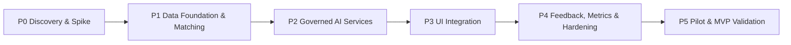
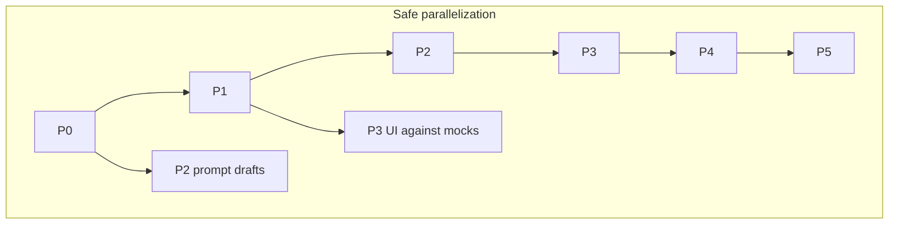

# Implementation Plan: AI-Assisted Incident Precedent Nudge

> Phase-wise build plan derived from `architecture.md` and `context.md`.  
> Goal: ship an MVP that surfaces historical incident precedent (and false/duplicate warnings) as **advisory** AI content for Incident Managers in the SAP EHS landscape (My Inbox + Manage Incidents).

---

## 0. Plan Overview

| Phase | Intent | Primary outcomes | Unlocks |
|-------|--------|------------------|---------|
| **P0** | De-risk UI host, deep link, Incident ID binding, data quality | AD-1 locked; FR6 proven; corpus audit | All build phases |
| **P1** | Precompute match pipeline without LLM summaries | Filter + similarity + threshold + `PrecedentResult` store | Panel data path |
| **P2** | Categorization, RCA summary, false/dup via GenAI Hub | FR1, FR4, FR7 in governed AI | Rich State A/B copy |
| **P3** | Teaser + panel in chosen hosts; fail open | FR5, FR6, FR8 live for managers | Usable MVP UX |
| **P4** | Feedback, observability, feature flags | FR9 + success-metric plumbing | Tunable pilot |
| **P5** | Limited pilot; measure; decide go/no-go | MVP validation metrics | Rollout decision |

### Guiding constraints (do not violate)

| Constraint | Source |
|------------|--------|
| Advisory only — **no** auto-fill of category / RCA / closure | `context.md` §5.2 |
| AI only via **SAP AI Core / Generative AI Hub** | NFR Governance |
| Fail open — task UI never blocked by AI | NFR Graceful degradation |
| Precompute on write path — **no** LLM on My Inbox GET | Architecture latency design |
| No My Inbox **list** view changes | MVP scope |
| Single best match (not multi-match carousel) | Architecture non-goals |

### Assumed team roles

| Role | Typical ownership |
|------|-------------------|
| Fiori / UX5 | My Inbox / Manage Incidents extension, deep link |
| CAP / BTP | Precedent API, store, jobs |
| AI / ML (SAP) | Embeddings, prompts, GenAI Hub deployments |
| EHS / IM functional | Task scope, threshold sense-check, pilot users |
| Security / IT | Landscape egress, auth, audit |
| Product / Safety ops | Feedback ownership (AD-8), pilot success criteria |

---

## Phase P0 — Discovery & Technical Spike

**Objective:** Resolve the open technical unknowns before committing schedule to UI and AI build.

**Duration (indicative):** 2–3 weeks  
**Depends on:** Access to Fiori Launchpad (EHS Apps), My Inbox work items, Manage Incidents, workflow admin, sample closed incidents.

### P0.1 — Lock panel host (AD-1)

| # | Task | Detail | Done when |
|---|------|--------|-----------|
| P0.1.1 | Document current task UX | Generic My Inbox preview + Open Task + SAP_WFRT (already observed) | Written spike note |
| P0.1.2 | Spike Strategy C | Can we inject content under Information-tab assignment text without breaking Claim/Forward/Open Task? | PoC or documented blocker |
| P0.1.3 | Spike Strategy D | Can we add a section on Manage Incidents **Investigation** facet? | PoC or documented blocker |
| P0.1.4 | Spike Strategy B (optional) | Cost of custom My Inbox task UI for IM work items | Rough estimate only |
| P0.1.5 | Decide AD-1 | Prefer **E (hybrid)** if C+D both feasible; else D-first or C-first | Decision recorded in `architecture.md` |

**Recommended decision:** Strategy **E** — My Inbox teaser + full panel on Manage Incidents Investigation.

### P0.2 — Incident ID binding from SAP_WFRT

| # | Task | Detail | Done when |
|---|------|--------|-----------|
| P0.2.1 | Inspect work-item container / BO | Confirm Incident ID is a stable technical parameter (not only title text like “Incident ID 388”) | Parameter name + sample values |
| P0.2.2 | Map task types for MVP | List which steps get the nudge: Root Causes Hierarchy, Review and complete investigation, others | Explicit MVP task allow-list |
| P0.2.3 | Define API key contract | `GET /precedents/{incidentId}` uses the same ID Manage Incidents uses | Contract doc |

### P0.3 — Deep link to Manage Incidents (FR6)

| # | Task | Detail | Done when |
|---|------|--------|-----------|
| P0.3.1 | Identify semantic object / action | Navigate to **exact** incident object page (not search) | Working nav from a test button |
| P0.3.2 | Optional: open Investigation tab | Prefer landing where Major Root Cause is visible | Demo or known limitation noted |
| P0.3.3 | Auth check | Manager can open closed historical incidents | Confirmed with security roles |

### P0.4 — Historical data quality audit

| # | Task | Detail | Done when |
|---|------|--------|-----------|
| P0.4.1 | Sample closed incidents | Measure fill rates for description, location, category, **Major Root Cause**, CAPA/corrective action, invalid/duplicate closure reasons | Audit report (% complete) |
| P0.4.2 | Set matching expectations | If RCA sparse → allow **link-only State A** (no summary) in MVP | Rule agreed |
| P0.4.3 | Identify false/dup closure codes | Exact status/reason values for FR7 | Code list documented |

### P0.5 — Platform & governance checklist

| # | Task | Done when |
|---|------|-----------|
| P0.5.1 | Confirm GenAI Hub / AI Core available in landscape | Access + sample inference |
| P0.5.2 | Confirm no public-LLM egress policy | Written IT/legal OK |
| P0.5.3 | Choose service host (CAP on BTP) and HANA/vector option (AD-2) | Tentative AD-2 |
| P0.5.4 | Identify incident create/update event or API for write path (AD-3) | Trigger candidate named |

### P0 exit criteria

Track live status in [`p0/checklists/p0-exit-gate.md`](p0/checklists/p0-exit-gate.md).

- [x] **AD-1** provisionally locked as **E (hybrid)** — FINAL after live C/D PoC (`p0/decisions/AD-1-panel-host.md`)
- [ ] Stable **Incident ID** extraction from work item proven (`p0/contracts/incident-id-binding.md`) — ⏳ LIVE
- [ ] **FR6** deep link demo to a real incident (`p0/contracts/deep-link-fr6.md`) — ⏳ LIVE
- [x] Link-only summary rule decided (`p0/decisions/link-only-summary-rule.md`); data quality audit template ready — ⏳ fill `p0/audit/sample-results.md`
- [x] MVP **task-type allow-list** drafted (`p0/contracts/mvp-task-allow-list.md`) — ⏳ EHS sign-off
- [ ] GenAI Hub path confirmed inside landscape (`p0/checklists/platform-governance.md`) — ⏳ LIVE

### P0 deliverables

| Deliverable | Location | Status |
|-------------|----------|--------|
| Spike decision record (AD-1) | `p0/decisions/`, `architecture.md` §15 | ✅ Provisional |
| Work-item → Incident ID mapping note | `p0/contracts/incident-id-binding.md` + PoC | ✅ Template + code; ⏳ live BO |
| Deep-link navigation parameters | `p0/contracts/deep-link-fr6.md` + `p0/poc/deep-link/` | ✅ PoC; ⏳ live intent |
| Data quality audit + false/dup codes | `p0/audit/` | ✅ Templates; ⏳ live numbers |
| Revised MVP scope (hybrid ≠ literal FR5) | `p0/decisions/revised-mvp-scope.md` | ✅ |
| Strategy C/D/B spike notes | `p0/spike-notes/` | ✅ Notes; ⏳ live PoC results |
| Platform / governance checklist | `p0/checklists/platform-governance.md` | ✅; ⏳ sign-off |
| Runnable PoC tests | `p0/package.json` → `npm test` | ✅ |

**Gate:** Do **not** start P3 UI build until AD-1 is FINAL and FR6 passes in landscape. P1 may start in parallel after P0.2/P0.4 are clear.

---

## Phase P1 — Data Foundation & Matching Engine

**Objective:** Implement the write-path match pipeline and sync read API **without** depending on LLM summaries yet (placeholder / template summary OK).

**Duration (indicative):** 3–4 weeks  
**Depends on:** P0.2, P0.4; AD-2/AD-3 tentative.

### P1.1 — Persistence & API skeleton

| # | Task | Maps to |
|---|------|---------|
| P1.1.1 | Create `PRECEDENT_RESULT`, `INCIDENT_EMBEDDING` (or vector index), config tables | Architecture §8 |
| P1.1.2 | Implement `GET /precedents/{incidentId}` returning READY / PENDING / UNAVAILABLE | Latency NFR |
| P1.1.3 | Implement feature flag + confidence threshold config (AD-4: global fixed) | FR3 |
| P1.1.4 | Circuit-breaker / soft errors: UI-facing GET never hard-fails the consumer | Fail open |

### P1.2 — Closed-incident indexing

| # | Task | Maps to |
|---|------|---------|
| P1.2.1 | Batch backfill embeddings for closed incidents with usable descriptions | FR2 |
| P1.2.2 | Stamp `modelVersion`; design re-embed job | Ops |
| P1.2.3 | Index invalid/duplicate closures into separate false/dup candidate pool | FR7 prep |
| P1.2.4 | On-close (or nightly) incremental index job | Freshness |

### P1.3 — Match search engine

| # | Task | Maps to |
|---|------|---------|
| P1.3.1 | Structured filter: location → equipment → category (configurable looseness) | FR2 |
| P1.3.2 | Rank candidates by description similarity | FR2 |
| P1.3.3 | Compute confidence score; apply threshold; pick **single** top match | FR3 |
| P1.3.4 | Persist State A skeleton: matched ID/number, confidence, deep-link params; summary empty or template | Store |
| P1.3.5 | Persist State C when below threshold | State C / AD-5 |

### P1.4 — Write-path orchestration (no LLM yet)

| # | Task | Maps to |
|---|------|---------|
| P1.4.1 | Hook trigger (event / workflow / job per AD-3) on incident create + significant field change | Write path |
| P1.4.2 | Async queue: categorize placeholder → match → store result | Precompute |
| P1.4.3 | Idempotent recompute endpoint (admin) | Support |

### P1.5 — Offline evaluation

| # | Task | Done when |
|---|------|-----------|
| P1.5.1 | Build labeled sample set (known “same location / similar” pairs from audit) | ≥ N pairs agreed with functional |
| P1.5.2 | Sweep thresholds; pick initial global threshold (AD-4) | Threshold + precision/recall notes |
| P1.5.3 | Document false-positive risk for managers | Shared with EHS |

### P1 exit criteria

Track details in [`p1/README.md`](p1/README.md).

- [x] Backfill index exists for sample / pilot-shaped data (`npm run backfill`) — ⏳ replace with live plant corpus
- [x] Async compute writes `PrecedentResult` for new incidents (`POST /incidents` + queue)
- [x] `GET /precedents/{id}` reads precomputed rows only (sub-second; fail-open 200)
- [x] Initial confidence threshold chosen and configurable — **0.5** from sample eval (`p1/eval/eval-report.md`); ⏳ EHS sign-off on live pairs
- [ ] Offline eval reviewed by EHS functional lead — report ready; ⏳ sign-off

### P1 deliverables

| Deliverable | Location | Status |
|-------------|----------|--------|
| CAP-equivalent Precedent service v0.1 | `p1/` (CDS schema + Node runtime) | ✅ |
| Embedding index + match job | `src/jobs/backfill.js`, `matchEngine.js` | ✅ (`bow-v1` stand-in) |
| Eval report + recommended threshold | `p1/eval/eval-report.md` | ✅ (sample); ⏳ live |
| API contract frozen for UI | `p1/API.md` | ✅ |

**Gate:** P2 prompts may start once match IDs are stable; P3 UI can stub against `GET /precedents/{id}` (seed demo uses incident `388`).

---

## Phase P2 — Governed AI Services

**Objective:** Add GenAI Hub–backed categorization, one-line RCA summary, and false/duplicate detection — still write-path only.

**Duration (indicative):** 3–4 weeks  
**Depends on:** P0.5 (GenAI Hub), P1 match IDs + RCA field mapping.

### P2.1 — Categorization (FR1)

| # | Task | Done when |
|---|------|-----------|
| P2.1.1 | Deploy categorization prompt + schema (type, severity, recordabilitySignal) on GenAI Hub | Inference works in-landscape |
| P2.1.2 | Persist AI category; use as match filter key | Stored + used in P1 filter |
| P2.1.3 | Fail soft: categorization error does not block incident create | Verified |

### P2.2 — Summary generation (FR4)

| # | Task | Done when |
|---|------|-----------|
| P2.2.1 | Ground prompt on **Major Root Cause** + CAPA/corrective action only | No speculative text in tests |
| P2.2.2 | If RCA/CAPA missing → link-only State A (no invented summary) | Per P0.4 rule |
| P2.2.3 | Version prompts; log template ID + model version on `PrecedentResult` | Audit fields populated |
| P2.2.4 | Advisory tone in generated one-liner (reference language, not directive) | Copy review |

### P2.3 — False / duplicate detector (FR7)

| # | Task | Done when |
|---|------|-----------|
| P2.3.1 | Query same-location past reports closed as not valid / duplicate (P0 codes) | Count N computed |
| P2.3.2 | Optional similarity gate so weak resemblance does not warn | Threshold documented |
| P2.3.3 | Attach State B payload separately from State A | Coexistence matrix honored |
| P2.3.4 | Confirm **advisory only** (AD-6) — no workflow block | Product sign-off |

### P2.4 — Resilience

| # | Task | Done when |
|---|------|-----------|
| P2.4.1 | Circuit breaker / retry around AI Core on write path | Outage → PENDING/UNAVAILABLE, not crash |
| P2.4.2 | Global feature flag to disable AI compute | Ops can flip without redeploy |

### P2 exit criteria

Track in [`p2/governance/exit-checklist.md`](p2/governance/exit-checklist.md).

- [x] FR1 categorization running (local provider ✅; GenAI Hub ⏳ landscape config)
- [x] FR4 summaries grounded; link-only fallback works (`p1/src/ai/grounding.js` + tests)
- [x] FR7 State B computed and stored
- [x] Zero egress outside SAP AI landscape **by design** — ⏳ IT sign-off on `p2/governance/evidence-pack.md`
- [x] Write path still async; GET path still LLM-free

### P2 deliverables

| Deliverable | Location | Status |
|-------------|----------|--------|
| Prompt pack (categorize, summarize) + versioning | `p2/prompts/`, `p1/src/ai/prompts.js` | ✅ |
| Updated compute pipeline (full State A/B/C) | `p1/src/jobs/compute.js` + AI orchestrator | ✅ |
| AI governance evidence pack | `p2/governance/` | ✅ (sign-off ⏳) |
| Circuit breaker + `aiComputeEnabled` flag | `p1/src/ai/` | ✅ |
| AD-6 advisory confirmation | `p2/governance/AD-6-advisory-only.md` | ✅ |

---

## Phase P3 — UI Integration (My Inbox + Manage Incidents)

**Objective:** Render States A/B/C with AI disclosure and deep links in the hosts chosen in AD-1.

**Duration (indicative):** 3–5 weeks (depends on hybrid vs single host)  
**Depends on:** P0 AD-1 + FR6; P1 API; P2 payloads preferred (can mock earlier).

### P3.1 — Shared panel component

| # | Task | Maps to |
|---|------|---------|
| P3.1.1 | Build reusable UI5 fragment/control: State A / B / C | FR5, FR7, FR8 |
| P3.1.2 | AI-generated advisory chrome (visual + i18n wording) | FR8 |
| P3.1.3 | Deep-link control using P0 semantic navigation | FR6 |
| P3.1.4 | Fail open: timeout/empty → hide or lightweight State C | NFR |
| P3.1.5 | **No** Apply/Copy RCA actions | Guardrail |

### P3.2 — My Inbox surface (Strategy C / E teaser)

| # | Task | Done when |
|---|------|-----------|
| P3.2.1 | Resolve Incident ID from selected SAP_WFRT work item | Stable fetch |
| P3.2.2 | Call `GET /precedents/{id}` when Information tab loads | Non-blocking |
| P3.2.3 | Render teaser or full panel under assignment text | Does not break Claim/Forward/Suspend/Open Task |
| P3.2.4 | Restrict to MVP task allow-list (P0.2.2) | Only targeted steps |
| P3.2.5 | **No** list-view changes | Verified |

### P3.3 — Manage Incidents surface (Strategy D / E full panel)

| # | Task | Done when |
|---|------|-----------|
| P3.3.1 | Add Precedent Panel on **Investigation** (preferred) or Details | Visible near Major Root Cause |
| P3.3.2 | Load precedent for current incident; same API | Consistent states |
| P3.3.3 | Deep link opens **matched** historical incident (not self) | FR6 |

### P3.4 — UX copy & accessibility

| # | Task | Done when |
|---|------|-----------|
| P3.4.1 | Finalize State A/B/C strings (advisory, not factual claims) | EHS + UX review |
| P3.4.2 | State C = lightweight note per AD-5 (default recommend) | Config wired |
| P3.4.3 | Keyboard / screen-reader: disclosure announced | A11y pass |

### P3.5 — Latency & pending behavior (AD-7)

| # | Task | Done when |
|---|------|-----------|
| P3.5.1 | READY → show panel within existing detail load expectations | Perceived “same load” |
| P3.5.2 | PENDING → omit or brief non-blocking skeleton (no spinner blocking actions) | Agreed behavior |
| P3.5.3 | UNAVAILABLE / error → silent omit | Fail open demo |

### P3 exit criteria

Track UX sign-off in [`p3/docs/ux-acceptance-checklist.md`](p3/docs/ux-acceptance-checklist.md).

- [x] End-to-end demo: My Inbox task → advisory → deep-link intent to matched incident (`p3/demo`) — ⏳ live FLP nav after FR6 config
- [x] Investigation facet full panel (hybrid Strategy E) in demo + UI5 extension stubs
- [x] Workflow actions always available during AI miss (demo footer + fail-open mapper)
- [ ] Incident Manager UX walkthrough signed off (pilot-ready) — ⏳ checklist

### P3 deliverables

| Deliverable | Location | Status |
|-------------|----------|--------|
| UI extensions (My Inbox teaser + Manage Incidents) | `p3/webapp/extension/` | ✅ stubs + integration guides; ⏳ FLP deploy |
| Shared panel + i18n + AI disclosure | `p3/webapp/fragment`, `i18n`, `css` | ✅ |
| Runnable hybrid demo | `p3/demo` | ✅ |
| UX acceptance checklist | `p3/docs/ux-acceptance-checklist.md` | ✅ |

---

## Phase P4 — Feedback, Metrics & Hardening

**Objective:** Capture FR9 feedback, instrument success metrics, harden for pilot.

**Duration (indicative):** 2–3 weeks  
**Depends on:** P3 live in test; AD-8 ownership named.

### P4.1 — Feedback (FR9)

| # | Task | Done when |
|---|------|-----------|
| P4.1.1 | “Not relevant” control on panel | Visible on State A (and optionally B) |
| P4.1.2 | `POST /precedents/{id}/feedback` → `MATCH_FEEDBACK` | Persisted with user, match ID, timestamp |
| P4.1.3 | Confirm v1 = log-only unless AD-8 funds tuning loop | Ownership recorded |

### P4.2 — Analytics for MVP validation

| Metric (from `context.md` §10) | Instrumentation |
|--------------------------------|-----------------|
| % matches shown with click-through | `panel_shown` (State A) + `deep_link_clicked` |
| Time saved (pilot survey) | Lightweight survey / interview script — not only telemetry |
| % false-dup warnings confirmed useful | Optional “helpful / not helpful” on State B or pilot interview |
| Trust vs ignore vs disruptive | Pilot feedback form + dismiss rate |

| # | Task | Done when |
|---|------|-----------|
| P4.2.1 | Emit/show-rate / click / dismiss events | Dashboard or queryable logs |
| P4.2.2 | Ops metrics: GET p95, compute success, AI Core errors | Alerting thresholds set |
| P4.2.3 | Pilot survey template | Ready for P5 |

### P4.3 — Hardening

| # | Task | Done when |
|---|------|-----------|
| P4.3.1 | AuthZ: precedent read = same as incident/task read | Security review |
| P4.3.2 | Audit log: model versions, match shown, user actions | Sample audit trail |
| P4.3.3 | Load test GET path; verify no LLM on read | Perf report |
| P4.3.4 | Runbook: disable flag, recompute, AI Core outage | Ops runbook |
| P4.3.5 | Regression: Open Task / Claim / Forward unaffected | QA sign-off |

### P4 exit criteria

Track details in [`p4/README.md`](p4/README.md).

- [x] FR9 feedback stored (`POST /precedents/{id}/feedback`)
- [x] Success-metric events available (`/events`, `/metrics/success`)
- [x] Security + ops runbook complete (`p4/docs/ops-runbook.md`, auth stub, audit) — ⏳ landscape security review
- [x] Test harness stable for pilot prep (`npm test`, `npm run loadtest`) — ⏳ FLP pilot env

### P4 deliverables

| Deliverable | Location | Status |
|-------------|----------|--------|
| Feedback API + UI | `p1` routes + `p3` dismiss/ratings | ✅ |
| Metrics dashboard / queries | `/metrics/*` + `p4/docs/metrics-queries.md` | ✅ |
| Pilot runbook + survey | `p4/docs/ops-runbook.md`, `pilot-survey.md` | ✅ |
| Go-live checklist for P5 | `p4/docs/p5-go-live-checklist.md` | ✅ |
| AD-8 log-only ownership | `p4/docs/AD-8-feedback-ownership.md` | ✅ |
| Load test (GET, no LLM) | `p1/scripts/loadtest-get.js` | ✅ |

---

## Phase P5 — Pilot & MVP Validation

**Objective:** Validate value with a limited Incident Manager cohort; decide rollout vs iterate.

**Duration (indicative):** 3–6 weeks pilot  
**Depends on:** P4 complete; pilot plants/locations with decent RCA fill rates (from P0 audit).

### P5.1 — Pilot setup

| # | Task | Done when |
|---|------|-----------|
| P5.1.1 | Select pilot group (managers + locations) | Named cohort |
| P5.1.2 | Enable feature flag for pilot only | Scoped rollout |
| P5.1.3 | Baseline: rough “time to start investigation” / search habits | Before snapshot |
| P5.1.4 | Train: advisory-only, how to use deep link, how to dismiss | Short enablement |

### P5.2 — Run & measure

| # | Task | Done when |
|---|------|-----------|
| P5.2.1 | Collect click-through, dismiss, State A/B show rates | Weekly readout |
| P5.2.2 | Spot-check match quality with EHS | False-confidence cases logged |
| P5.2.3 | Adjust threshold if noise too high (AD-4) | Change controlled + logged |
| P5.2.4 | Mid-pilot interviews (trust / ignore / disrupt) | Notes synthesized |

### P5.3 — Go / no-go

| Decision | Criteria (example — finalize with product) |
|----------|-----------------------------------------------|
| **Go broader** | Click-through meaningful; managers report time saved; low “disruptive” rate; no compliance issues |
| **Iterate** | Useful but noisy → raise threshold / improve filters; keep pilot |
| **Pause** | Low trust, high dismiss, or governance blocker |

### P5 exit criteria

Operational exit — artifacts in [`p5/`](p5/). Live cohort run still required for final numbers.

- [x] MVP validation **framework** reported against context.md §10 (`scripts/weekly-readout.js`, `go-no-go.js`, results report template)
- [x] Open questions 1–3 **capture slots** in `reports/pilot-results-report.md` — ⏳ fill after live pilot
- [x] Rollout / stop **templates** ready (`templates/rollout-plan.md`, `tuning-backlog.md`) — ⏳ execute decision post-pilot

### P5 deliverables

| Deliverable | Location | Status |
|-------------|----------|--------|
| Pilot cohort + scoped flag | `p5/config/pilot-cohort.json` + `pilotMode` API gate | ✅ |
| Enablement + baseline | `p5/enablement/`, `templates/baseline-and-survey-log.md` | ✅ |
| Weekly readout + threshold change control | `p5/scripts/weekly-readout.js`, `adjust-threshold.js` | ✅ |
| Match quality + interview templates | `templates/match-quality-log.md`, `interview-notes.md` | ✅ |
| Go/no-go + results report | `scripts/go-no-go.js`, `reports/pilot-results-report.md` | ✅ |
| Tuning backlog + rollout plan | `templates/tuning-backlog.md`, `rollout-plan.md` | ✅ |

---

## Cross-Phase Workstream Map

| Workstream | P0 | P1 | P2 | P3 | P4 | P5 |
|------------|----|----|----|----|----|-----|
| Fiori / UX5 | Spike C/D/E, deep link | — | — | Panel hosts | A11y / feedback UI | Pilot support |
| CAP / data | AD-2/3, ID binding | Index, match, API | Pipeline hooks | — | Feedback API, metrics | Recompute support |
| AI / GenAI Hub | Access proof | Embeddings | Categorize, summarize, FR7 AI assists | — | Model monitoring | Threshold/prompt tune |
| EHS functional | Audit, task allow-list | Eval labels | Copy review | UX walkthrough | Survey design | Pilot & go/no-go |
| Security / IT | Egress / Hub OK | Auth design | Governance pack | — | Security review | — |

---

## Requirements Traceability by Phase

| Requirement | Primary phase | Also covered in |
|-------------|---------------|-----------------|
| FR1 Categorization | P2 | P1 placeholder filter keys |
| FR2 Match search | P1 | P2 category enrichment |
| FR3 Confidence threshold | P1 | P5 tuning |
| FR4 RCA summary | P2 | P0 data-quality rule |
| FR5 Panel in task/investigation UX | P3 | P0 AD-1 |
| FR6 Deep link | P0 prove / P3 ship | — |
| FR7 False/dup warning | P2 | P3 UI State B |
| FR8 AI disclosure | P3 | P2 prompt tone |
| FR9 Feedback | P4 | P5 use of feedback |
| Latency | P1 GET + P3 UX | Architecture precompute |
| Governance | P0 + P2 | P4 audit |
| Fail open | P1 API + P3 UI | P4 outage runbook |

---

## Open Decisions — When They Close

| ID | Decision | Closes in | Default if unresolved |
|----|----------|-----------|------------------------|
| AD-1 | Panel host B/C/D/E | **P0** | E hybrid if both C+D work; else **D** (Manage Incidents) |
| AD-2 | Vector store | P0/P1 | HANA Vector if data already on HANA |
| AD-3 | Write-path trigger | P0/P1 | Event on create + significant update; batch fallback |
| AD-4 | Confidence threshold | P1 initial / **P5** refine | Fixed global from eval |
| AD-5 | State C UX | P3 | Lightweight note |
| AD-6 | State B blocking | P2 | Advisory only |
| AD-7 | Pending UI | P3 | Omit panel if not READY |
| AD-8 | Feedback ownership | P4 before promising tuning | Log-only in v1 |

---

## Risk Burndown by Phase

| Risk | Mitigate in | Action |
|------|-------------|--------|
| Generic My Inbox cannot host rich panel | P0 | Prefer hybrid / D |
| Incident ID only in title | P0 | Require BO/container parameter |
| Deep link = search only | P0 | Block P3 until object navigation works |
| Sparse Major Root Cause | P0/P2 | Link-only State A |
| Slow AI at task open | P1–P3 | Precompute only; enforce no LLM on GET |
| Overconfident wrong matches | P1/P5 | Strict threshold; FR8; FR9 dismiss |
| AI Core outage | P2/P4 | Fail open + feature flag + runbook |
| Managers ignore panel | P3/P5 | Latency + placement on Investigation; measure click-through |

---

## Definition of Done — MVP

MVP is **done** when all of the following are true:

1. For allow-listed My Inbox IM tasks (SAP_WFRT), manager sees an **advisory** precedent teaser/panel or an honest State C, without list-view changes.
2. Full State A includes matched incident reference, optional grounded one-line summary, and **working deep link** to that Manage Incidents record.
3. State B can appear for false/duplicate patterns; it does **not** block workflow.
4. No auto-fill of investigation/RCA/closure fields.
5. AI compute runs only in **SAP AI Core / GenAI Hub**; task UI works if AI is down.
6. Panel GET is fast (precomputed); dismiss/feedback is logged (FR9).
7. Pilot metrics against `context.md` §10 are collected and a rollout recommendation exists.

---

## Suggested Immediate Next Steps (Week 1)

1. Schedule P0 spike with Fiori/UX5 + workflow admin (AD-1, Incident ID, FR6).
2. Pull closed-incident sample for data-quality audit (Major Root Cause / CAPA fill rates).
3. Confirm GenAI Hub project access with IT.
4. Draft MVP task allow-list with EHS (Root Causes Hierarchy vs review-only).
5. Update `architecture.md` AD-1 once spike decides host strategy.

---

*Derived from `architecture.md` and `context.md`. Re-baseline phase dates after P0 exit gate.*
